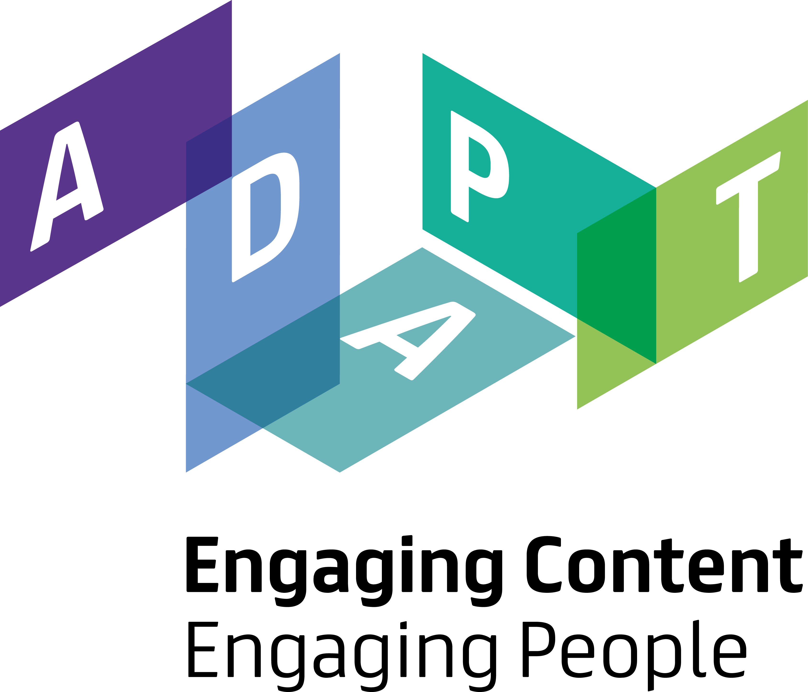

```{r setup, include=FALSE}
knitr::opts_chunk$set(echo = TRUE)
```


## Medline impactful discoveries (January 2022)

This tool proposes an interactive interface to explore the discoveries extracted from [Medline](https://www.nlm.nih.gov/medline/index.html) (MeSH descriptors) using the method introduced in **[paper pending]**.

- Go to the tool: [Medline impactful discoveries](medline-discoveries/)
- The corresponding implementation is available in [this github repository](https://github.com/erwanm/medline-discoveries) with a detailed documentation.
- The full dataset can be downloaded from **[TODO]**.

## A contrastive approach for LBD (July 2021)

The tools below propose an interactive interface to explore relations between some neurodegenerative concepts extracted from the biomedical literature. The tools are prototypes for a new literature-based discovery method presented in [this paper](https://doi.org/10.1101/2021.09.22.461375). 

- [Associated concepts by ND target](baseline-view/) ([documentation](baseline-view.user-guide/))
- [Contrast two Datasets given a Target Concept](contrast-views/) ([documentation](contrast-views.user-guide/))


The code for the contrast method can be found in [this github repository](https://github.com/erwanm/lbd-contrast).


## Contact

Feedback/queries: [erwan.moreau@adaptcentre.ie](mailto:erwan.moreau@adaptcentre.ie?subject=[BrainMEND-tools])

## Acknowledgements

This work was conducted with the financial support of Irish Health Research Board (HRB) BRAINMend project (grant number HRB-JPI-JPND-2017-1) and with the support of the Science Foundation Ireland Research Centre ADAPT (grant number 13/RC/2106\_P2).

The interactive interface is implemented with [Shiny](https://shiny.rstudio.com) and the documentation uses [RMarkdown](https://rmarkdown.rstudio.com/).

{#id .class width=40% height=40% align="right" padding=10%}
{#id .class width=15% height=15% align="right" padding=10%}

